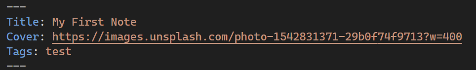

# Note Cards

A simple extension to let you view all your md notes as cards! If you have used note-taking apps like [Obsidian](https://obsidian.md/), you will find using this extension easy.

## Features

1. View all your md notes as cards.
2. Filter your notes by tags.
3. Add a Cover to your cards. 
4. Light/Dark mode can be chosen!

## Usage

1. Open VSCode.
2. Click the extension market
3. Search for "Note Cards" and install it.
4. Open a folder containing your md notes.

You can use Yaml front matter in your md notes to add a cover to your cards. The cover will be displayed on the card. The cover can be a link to an image or a local image.

## Known Issues

1. using multiple Heading 1 will cause the cards to be grouped together.
2. using HTML like `
` in md files seems to cause the cards to be grouped together.

**Enjoy!**
